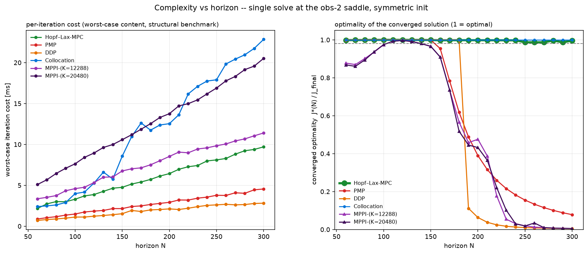

# Hopf-Lax-MPC

Closed-loop and open-loop comparison of a certified Hopf-Lax quasi-Newton MPC solver ("M1_v2",
displayed as Hopf-Lax-MPC) against PMP shooting, DDP, direct collocation (CasADi/IPOPT) and GPU MPPI,
on a corridor scenario with a symmetric obstacle saddle.

This repository is the self-contained, minimal set of scripts that reproduces the two headline
results. It was distilled on 2026-09-22 from a longer design-iteration folder; every file here was
verified to run from this folder alone.

| result | data | produced by |
|---|---|---|
| `figs/anim_all_methods.mp4` -- closed-loop 3-D animation, 6 runners | `results_testbed_v10.pkl` (not in repo, 44 MB) | `mpc_testbed.py` -> `make_animations.py` |
| `figs/complexity_vs_N_maxiter.png` -- open-loop complexity vs horizon | `results_complexity.pkl` (in repo, 2.3 MB) | `complexity_vs_horizon.py` -> `plot_complexity_maxiter.py` |



## Repository structure

| file | role |
|---|---|
| `mpc_core.py` | plant, cost, dynamics, reference path (JAX); verified against the MATLAB reference |
| `mpc_solvers.py` | PMP (Levenberg-Marquardt shooting), DDP, collocation (CasADi/IPOPT), Hopf-Lax certified quasi-Newton primitives |
| `mpc_mppi.py` | GPU MPPI (CuPy) |
| `mpc_tuned_params.py` | **all scenario tuning** in one module: `apply_wall_course(P)` (the v6 corridor course: moving wall that stops, lane blocker, closing door, shoulder blocker) and `apply(P)` (the v10 unified-route course: wall course plus a downstream fork with an arriving hot companion, re-calibrated horizons and MPPI pins). Flattened from the former five-module chain `mpc_tuned_params -> _v5 -> _v6 -> _v7 -> _v10`; verified field-for-field identical to what that chain produced |
| `mpc_testbed.py` | closed-loop comparison on the unified-route course under a hard 20 ms/cycle budget (formerly `mpc_testbed_v10.py`). Also provides the M1_v2 solver (`chlqn_solve`) and the piecewise obstacle motion used by the complexity study |
| `make_animations.py` | 3-D animation renderer; reads a testbed pickle |
| `complexity_vs_horizon.py` | open-loop solve-trace sweep over horizon N at the obs-2 saddle from a symmetric initial guess; merges into `results_complexity.pkl` |
| `plot_complexity_maxiter.py` | renders `figs/complexity_vs_N_maxiter.png` from `results_complexity.pkl` |
| `COMPLEXITY_FIGURE.md` | full protocol, metric definitions, and takeaways of the complexity figure |
| `results_complexity.pkl` | recorded solve traces and structural per-iteration benchmarks behind the figure (Jul 28 2026) |
| `figs/` | the two published results |

Not in the repository: `results_testbed_v10.pkl`, the 44 MB recorded closed-loop run behind the
animation. Regenerate it with `mpc_testbed.py` (see below) or ask the authors for the file.

## Environment

All dependencies are pinned in `environment.yml` (conda) and `requirements.txt` (pip): Python 3.13,
numpy, scipy, JAX (CPU, shooting methods and DDP), CasADi with bundled IPOPT (collocation),
matplotlib, imageio-ffmpeg (mp4 rendering) and CuPy on CUDA 12.x (GPU MPPI). These are the exact
versions that produced the published results.

Create and activate the environment in one go:

```bash
git clone https://github.com/GuanQinG-GitHub/Hopf-Lax-MPC.git
cd Hopf-Lax-MPC
conda env create -f environment.yml
conda activate mpcpy
```

Without an NVIDIA GPU, delete the `cupy-cuda12x` line from `environment.yml` before creating the
environment and run the testbed with `--no-mppi`; everything else runs on the CPU. Pip users can
instead run `pip install -r requirements.txt` inside any Python 3.13 environment.

Run every command **from the repository root** (all paths are working-directory relative). The
PowerShell snippets below use `$py` for the interpreter; with the environment activated it is simply:

```powershell
$py = "python"
```

## 1. Closed-loop animation

Run the closed loop (writes `results_testbed_v10.pkl`), then render:

```powershell
& $py mpc_testbed.py            # PMP, DDP, collocation, M1_v2, MPPI x2; 20 ms/cycle budget
& $py mpc_testbed.py --smoke    # 60-cycle pipeline check
& $py mpc_testbed.py --no-mppi  # without a CUDA GPU

& $py make_animations.py results_testbed_v10.pkl        # combined video + one clip per runner -> figs/
& $py make_animations.py results_testbed_v10.pkl c      # combined video only
```

The closed loop runs under a wall-clock budget, so a re-run reproduces the qualitative outcome
(PMP trapped at the wall, DDP trapped at the fork, Hopf-Lax-MPC reaches the goal, MPPI detours) but
not the recorded run bit-for-bit. The committed video was rendered from the recorded run with an
earlier colour style of `make_animations.py`; trajectories are identical.

## 2. Complexity figure

From the committed data (seconds; pixel-identical to the committed figure):

```powershell
& $py plot_complexity_maxiter.py                        # -> figs/complexity_vs_N_maxiter.png
```

Full regeneration of the data (hours; never run two timing jobs at once; the pickle is merged
incrementally, so single methods can be redone):

```powershell
$Ns = (6..30 | ForEach-Object { $_ * 10 }) -join ","   # 60,70,...,300
foreach ($m in "m1v2","pmp","ddp","coll","mppi8192","mppi12288","mppi16384","mppi20480") {
  & $py complexity_vs_horizon.py --methods $m --Ns $Ns
}
& $py complexity_vs_horizon.py --rescore      # REQUIRED after any m1v2/pmp sweep (common metric)
& $py complexity_vs_horizon.py --iterbench    # structural per-iteration benchmarks (m1v2/pmp/ddp)
& $py plot_complexity_maxiter.py
```

Absolute ms values are machine-specific; orderings and slopes are the portable content. The initial
state `x0` is cached inside `results_complexity.pkl`; only if the pickle is deleted does the script
try to re-derive it by replaying a v6-course closed loop (it then looks for `results_testbed_v6.pkl`,
which is not part of this repository).

See `COMPLEXITY_FIGURE.md` for the protocol, the common optimality metric, and the interpretation
of the figure.
