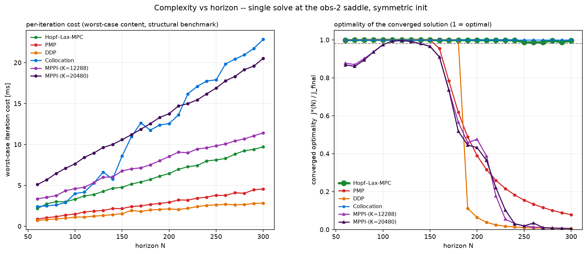
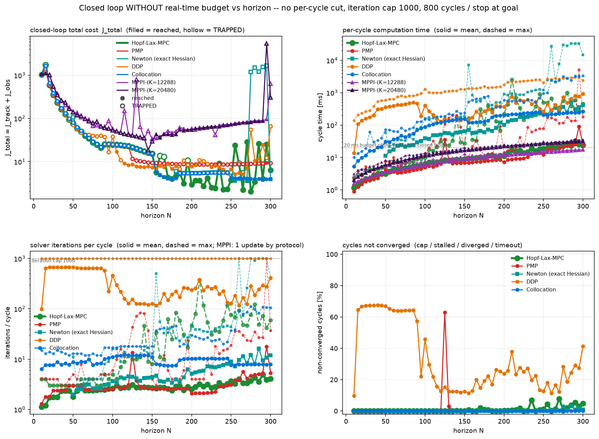
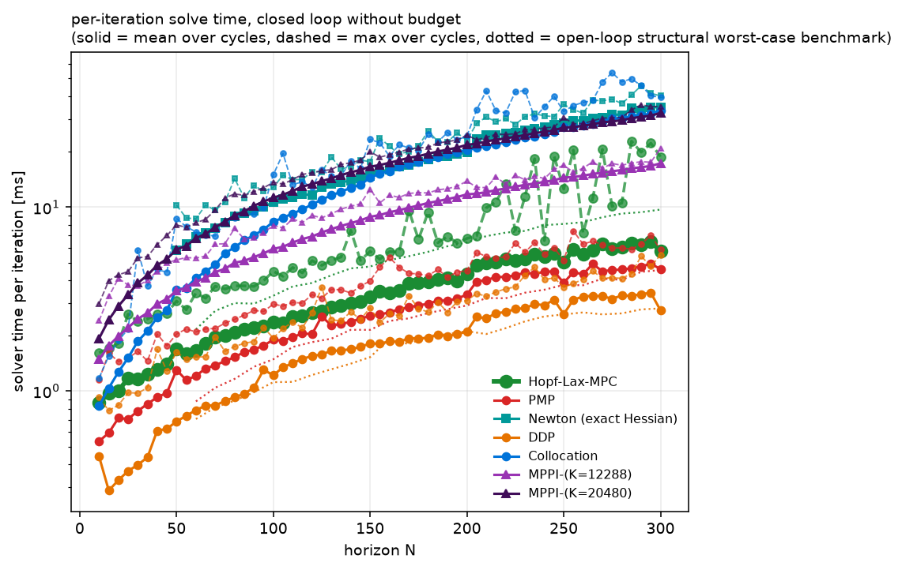

# Hopf-Lax-MPC

Closed-loop and open-loop comparison of a certified Hopf-Lax quasi-Newton MPC solver ("M1_v2",
displayed as Hopf-Lax-MPC) against PMP shooting, DDP, direct collocation (CasADi/IPOPT) and GPU MPPI,
on a corridor scenario with a symmetric obstacle saddle.

This repository is the self-contained, minimal set of scripts that reproduces the two headline
results. It was distilled on 2026-09-22 from a longer design-iteration folder; every file here was
verified to run from this folder alone.

| result | data | produced by |
|---|---|---|
| `figs/anim_all_methods.mp4` -- closed-loop 3-D animation, 6 runners | `results_testbed_v10.pkl` (not in repo, 44 MB) | `mpc_testbed.py` -> `make_animations.py` |
| `figs/complexity_vs_N_maxiter.png` -- open-loop complexity vs horizon | `results_complexity.pkl` (in repo, 2.3 MB) | `complexity_vs_horizon.py` -> `plot_complexity_maxiter.py` |



## Repository structure

| file | role |
|---|---|
| `mpc_core.py` | plant, cost, dynamics, reference path (JAX); verified against the MATLAB reference |
| `mpc_solvers.py` | all solvers: the M1_v2 method (`chlqn_solve`, paper Algorithm 1 -- certified Hopf-Lax quasi-Newton) and the baselines it is compared against -- PMP (Levenberg-Marquardt shooting), iLQR, DDP, collocation (CasADi/IPOPT) |
| `mpc_mppi.py` | GPU MPPI (CuPy) |
| `mpc_tuned_params.py` | **all scenario tuning** in one module: `apply_wall_course(P)` (the v6 corridor course: moving wall that stops, lane blocker, closing door, shoulder blocker) and `apply(P)` (the v10 unified-route course: wall course plus a downstream fork with an arriving hot companion, re-calibrated horizons and MPPI pins). Flattened from the former five-module chain `mpc_tuned_params -> _v5 -> _v6 -> _v7 -> _v10`; verified field-for-field identical to what that chain produced |
| `mpc_testbed.py` | closed-loop comparison on the unified-route course under a hard 20 ms/cycle budget (formerly `mpc_testbed_v10.py`). Holds the per-method closed-loop runners and the piecewise obstacle motion used by the complexity study; the solvers themselves live in `mpc_solvers.py` |
| `make_animations.py` | 3-D animation renderer; reads a testbed pickle |
| `complexity_vs_horizon.py` | open-loop solve-trace sweep over horizon N at the obs-2 saddle from a symmetric initial guess; merges into `results_complexity.pkl` |
| `plot_complexity_maxiter.py` | renders `figs/complexity_vs_N_maxiter.png` from `results_complexity.pkl` |
| `COMPLEXITY_FIGURE.md` | full protocol, metric definitions, and takeaways of the complexity figure |
| `results_complexity.pkl` | recorded solve traces and structural per-iteration benchmarks behind the figure (Jul 28 2026) |
| `figs/` | the two published results |

Not in the repository: `results_testbed_v10.pkl`, the 44 MB recorded closed-loop run behind the
animation. Regenerate it with `mpc_testbed.py` (see below) or ask the authors for the file.

## Environment

All dependencies are pinned in `environment.yml` (conda) and `requirements.txt` (pip): Python 3.13,
numpy, scipy, JAX (CPU, shooting methods and DDP), CasADi with bundled IPOPT (collocation),
matplotlib, imageio-ffmpeg (mp4 rendering) and CuPy on CUDA 12.x (GPU MPPI). These are the exact
versions that produced the published results.

Both files work unchanged on **Windows, Linux and macOS**. Only the GPU MPPI baseline is
platform-dependent, and it is handled automatically:

| platform | GPU MPPI (CuPy) | how to run |
|---|---|---|
| Windows / Linux **with** an NVIDIA GPU (CUDA 12.x driver) | installed | all commands as written |
| Windows / Linux **without** an NVIDIA GPU | delete the `cupy-cuda12x` line before creating the environment | add `--no-mppi` |
| macOS (Intel or Apple Silicon) | **skipped automatically** -- no CUDA on Apple hardware, and CuPy publishes no macOS wheel | add `--no-mppi` |

The `cupy-cuda12x` entry carries the environment marker `; platform_system != "Darwin"`, so pip
installs it on Windows/Linux and silently skips it on macOS. macOS users therefore do **not** need to
edit any file -- just create the environment as below. Everything except MPPI is pure CPU and runs
identically on all three platforms.

Create and activate the environment in one go (same on every platform):

```bash
git clone https://github.com/GuanQinG-GitHub/Hopf-Lax-MPC.git
cd Hopf-Lax-MPC
conda env create -f environment.yml
conda activate HopfLaxMPC
```

Check the installation.  With a CUDA GPU (Windows/Linux):

```bash
python -c "import jax, casadi, cupy, imageio_ffmpeg; print('ok', cupy.cuda.runtime.getDeviceCount(), 'GPU(s)')"
```

On macOS, or on any machine without a GPU, leave `cupy` out of the check -- it is not installed
there and importing it will fail:

```bash
python -c "import jax, casadi, imageio_ffmpeg; print('ok', jax.devices())"
```

Pip users can instead run `pip install -r requirements.txt` inside any Python 3.13 environment; the
same marker applies, so that one command is also correct on all three platforms.

Troubleshooting: if the check above fails with `No module named 'cupy'` (or another listed package)
on a machine that should have it, pip found an existing copy in your per-user site-packages and
skipped installing it into the new environment. Set `PYTHONNOUSERSITE=1` before creating the
environment (PowerShell: `$env:PYTHONNOUSERSITE = 1`; bash/zsh: `export PYTHONNOUSERSITE=1`), or
install the missing package into the activated environment with
`pip install --ignore-installed "cupy-cuda12x[ctk]==14.1.1"`.

A second failure mode, seen on macOS: `conda env create` reports that the whole `pip` step failed and
the environment ends up with *no* packages at all. That is the old unconditional `cupy-cuda12x` pin --
conda hands the entire `pip:` list to pip as one install, so a single unresolvable wheel aborts all of
them. The marker above fixes it; if you hit it with an older checkout, just pull and re-create.

Run every command **from the repository root** (all paths are working-directory relative). The
PowerShell snippets below use `$py` for the interpreter; with the environment activated it is simply:

```powershell
$py = "python"
```

On macOS/Linux, drop the `& $py` prefix and call `python` directly -- e.g.
`python mpc_testbed.py --no-mppi`.

## 1. Closed-loop animation

Run the closed loop (writes `results_testbed_v10.pkl`), then render:

```powershell
& $py mpc_testbed.py            # PMP, DDP, collocation, M1_v2, MPPI x2; 20 ms/cycle budget
& $py mpc_testbed.py --smoke    # 60-cycle pipeline check
& $py mpc_testbed.py --no-mppi  # without a CUDA GPU (always on macOS)

& $py make_animations.py results_testbed_v10.pkl        # combined video + one clip per runner -> figs/
& $py make_animations.py results_testbed_v10.pkl c      # combined video only
```

The closed loop runs under a wall-clock budget, so a re-run reproduces the qualitative outcome
(PMP trapped at the wall, DDP trapped at the fork, Hopf-Lax-MPC reaches the goal, MPPI detours) but
not the recorded run bit-for-bit. The committed video was rendered from the recorded run with an
earlier colour style of `make_animations.py`; trajectories are identical.

## 2. Complexity figure

From the committed data (seconds; pixel-identical to the committed figure):

```powershell
& $py plot_complexity_maxiter.py                        # -> figs/complexity_vs_N_maxiter.png
```

Full regeneration of the data (hours; never run two timing jobs at once; the pickle is merged
incrementally, so single methods can be redone):

```powershell
$Ns = (6..30 | ForEach-Object { $_ * 10 }) -join ","   # 60,70,...,300
foreach ($m in "m1v2","pmp","ddp","coll","mppi8192","mppi12288","mppi16384","mppi20480") {
  & $py complexity_vs_horizon.py --methods $m --Ns $Ns
}
& $py complexity_vs_horizon.py --rescore      # REQUIRED after any m1v2/pmp sweep (common metric)

& $py complexity_vs_horizon.py --iterbench    # structural per-iteration benchmarks (m1v2/pmp/ddp)
& $py plot_complexity_maxiter.py
```

On macOS, run only the CPU methods -- `m1v2`, `pmp`, `ddp`, `coll`; the four `mppi*` sweeps need the
CUDA GPU. The committed `results_complexity.pkl` already contains the MPPI traces, so
`plot_complexity_maxiter.py` still reproduces the full figure.

Absolute ms values are machine-specific; orderings and slopes are the portable content. The initial
state `x0` is cached inside `results_complexity.pkl`; only if the pickle is deleted does the script
try to re-derive it by replaying a v6-course closed loop (it then looks for `results_testbed_v6.pkl`,
which is not part of this repository).

See `COMPLEXITY_FIGURE.md` for the protocol, the common optimality metric, and the interpretation
of the figure.

## 3. Closed loop without a real-time budget vs horizon



The closed-loop testbed of section 1 runs every method under a hard 20 ms/cycle budget at one tuned
horizon each. This experiment removes the budget and sweeps the horizon instead: same scenario,
obstacles, warm starts and stop-at-goal protocol, but every solver runs to convergence or to an
iteration cap of 1000 (`lm_maxit`, `ilqr_Kmax`, IPOPT `max_iter`), and N takes the values
50, 100, 150, 200, 250, 300 for all six runners. MPPI keeps its published protocol of one sampling
update per cycle (there is no iteration loop to unbudget), at K = 12288 and K = 20480.

| file | role |
|---|---|
| `mpc_testbed_N_sweep.py` | sweep driver with instrumented copies of the five testbed runners (the originals discard iteration counts); records per cycle the solve time, iteration count, termination status, final residual and method-specific counters; merges into `results_N_sweep.pkl`, saved after every (method, N) run so it can be interrupted and resumed |
| `plot_N_sweep.py` | the 2 x 2 figure above and a per-(method, N) table |
| `results_N_sweep.pkl` | the recorded sweep (4.8 MB, 36 runs, Oct 7 2026, about 1 h 10 min wall time) |

```powershell
& $py mpc_testbed_N_sweep.py --selftest       # counted solver copies == originals, bitwise
& $py mpc_testbed_N_sweep.py --smoke           # 60-cycle pipeline check -> results_N_sweep_smoke.pkl
& $py mpc_testbed_N_sweep.py                   # full sweep (resumable; --methods, --Ns, --redo, --cap)
& $py plot_N_sweep.py                          # -> figs/N_sweep_nobudget.png + table
```

Statuses per cycle: `converged`, `acceptable` (IPOPT), `cap` (hit 1000 iterations while still
accepting steps), `stalled` (no accepted step for 50+ iterations, i.e. a damping crawl into the cap,
or a failed line search), `esc-stalled` (Hopf-Lax-MPC escape without an improving step), `diverged`,
`timeout` (only with `--cycle-timeout`). Timing statistics exclude cycle 1 and recompile-tagged cycles.

What the recorded sweep shows (panel by panel):

- **Cost.** Hopf-Lax-MPC reaches the goal from N = 200 on and has the lowest closed-loop cost of all
  methods at N = 200 and 250. Collocation reaches from N = 250 and is lowest at N = 300. DDP reaches
  only at N = 150 to 250 and is trapped again at N = 300. PMP is trapped at every horizon. MPPI reaches
  at N = 200 and 250 but with an order of magnitude more obstacle cost, and collapses at N = 300.
  Below N = 200 the horizon is too short to see around the wall for every method.
- **Time.** Without a budget, Hopf-Lax-MPC and PMP stay near the 20 ms line on average up to N = 300;
  collocation costs 30 to 260 ms per cycle; DDP costs 150 to 900 ms per cycle on average with
  worst cycles above 2 s.
- **Iterations.** Hopf-Lax-MPC, PMP and collocation need 2 to 11 iterations per cycle on average.
  DDP averages 130 to 670 and hits the cap at every horizon.
- **Non-convergence.** DDP fails to converge in 12 to 67 percent of cycles (damping crawls at the
  stiff barriers). Hopf-Lax-MPC has a few stalled escape cycles at N = 250 and 300; PMP and
  collocation converge in every cycle.

The cycle time above is the whole solve of a cycle, i.e. all of its iterations. The per-iteration
cost is the second figure, `figs/N_sweep_periter.png` (also written by `plot_N_sweep.py`): for every
cycle the solver time divided by its iteration count, then the mean (solid) and max (dashed) over the
cycles of a run. Cycles with zero iterations (warm start already converged) are excluded; for MPPI it
equals the cycle time since it does one update per cycle. The dotted lines are the open-loop
structural worst-case per-iteration benchmark of the complexity study (`results_complexity.pkl`,
`iterbench`), overlaid as a cross-check.



- **Per-iteration cost.** DDP has the cheapest iteration (0.7 to 2.7 ms), then PMP (1.3 to 4.6 ms)
  and Hopf-Lax-MPC (1.7 to 5.8 ms mean; its worst cycle-average iteration, the kick-firing escape
  iteration, reaches 19 ms at N = 300). Collocation's IPOPT iteration is 4 to 34 ms, and one MPPI
  update costs 3.5 to 17 ms (K = 12288) or 6 to 32 ms (K = 20480). All grow close to linearly in N.
  The closed-loop means agree with the open-loop benchmark: PMP and DDP sit on their benchmark
  lines, and Hopf-Lax-MPC's mean lies between PMP's line and its own worst-case kick iteration.
